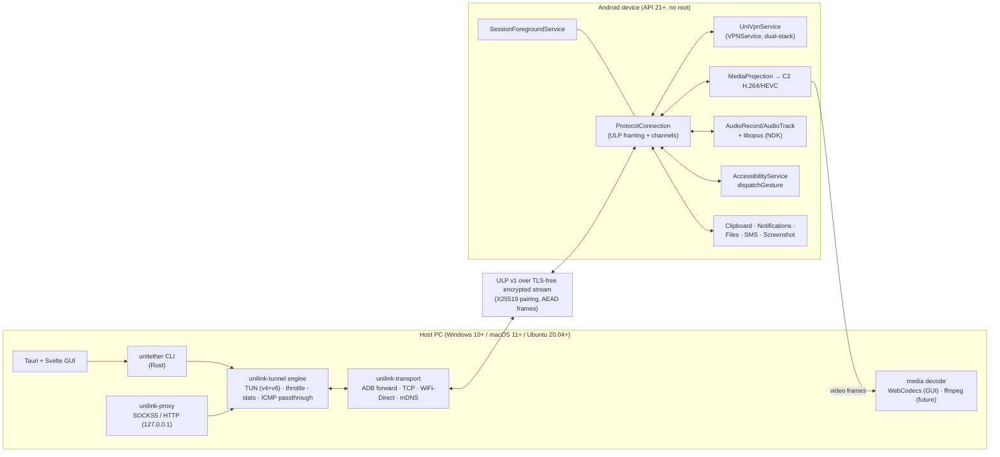
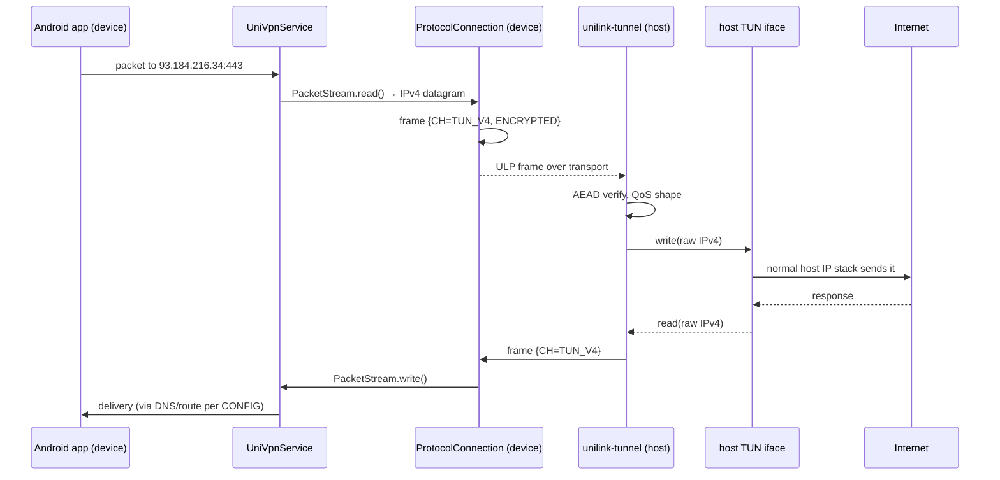

# 01 — Architecture

## 1. Design goals

1. **One protocol, many transports.** The byte stream is identical over
   ADB, LAN TCP, Wi-Fi Direct and Bluetooth PAN. Transport is a
   swappable, liveness-managed layer; everything above it is blind to
   the wire.
   - *Implemented (host):* `unilink_transport::Transport` trait
     (frame/raw read+write, shutdown, name) + `Framed<S>` — the single
     byte-stream reassembly for any `Read + Write` stream
     (`StreamDeadline` opts in to read deadlines; `TcpStream` does).
     `FramedConn` = `Framed<TcpStream>` + TCP connect/listen/shutdown;
     the ULP session is `Session<T: Transport>` — transport-agnostic.
     A future QUIC/relay transport is an adapter behind the same
     trait (experimental, not yet implemented). Invariant: frame path
     and raw path share one byte reservoir, so TCP-coalesced frames
     can never be dropped between the handshake and encrypted phases.
2. **Host = engine, device = appliance.** The heavy lifting (TUN,
   proxy, stats, scheduling) lives on the host in Rust. The Android app
   is a permission-aware appliance (VPN, capture, audio) that speaks
   ULP.
3. **No root, no daemons-on-device.** Android uses only normal app
   privileges; the host needs no setuid components (TUN access via
   `netdev` group on Linux).
4. **Spec-first protocol.** `docs/02-PROTOCOL.md` + `protocol/vectors/`
   are the contract; host (Rust), device (Kotlin), and the Python/Node
   conformance suites all build against it.

## 2. System overview

## 3. Host-side components

| Crate | Responsibility | Key deps |
|---|---|---|
| `unilink-protocol` | ULP framing, channels, messages, cipher profiles, vectors | none (std) — `zstd`, `x25519-dalek`, `sha2` behind features |
| `unilink-transport` | `adb` (adb-forward + monitor), `tcp` LAN, `wifidirect` group, `mdns` discovery, pairing blob, session state | `tokio`, `mdns-sd`, `qrcode` |
| `unilink-tunnel` | TUN device (linux/mac/win), dual-stack engine, token-bucket QoS, latency/loss injectors, stats, ICMP passthrough | `libc`/`windows`, `tun` (windows: WinTun) |
| `unilink-proxy` | SOCKS5 + HTTP proxy bound to loopback, bridged into tunnel proxy channel | `tokio` |
| `unitether` | CLI binary, config (`~/.config/unitether/config.toml`), session management, tray hooks | `clap` |
| `gui/src-tauri` | Tauri commands ↔ session, stats events, mirror NAL delivery to WebCodecs | `tauri` |

## 4. Device-side components

| Package | Responsibility |
|---|---|
| `net.UniVpnService` | Dual-stack `VPNService`; forwards PacketStream ↔ TUN_V4/V6 channels; custom DNS + routes from CONFIG |
| `net.ProtocolConnection` | ULP framing, channel dispatch, reassembly, cipher, liveness ping, QoS shaper |
| `net.transport.*` | ADB (local-abstract socket), LAN TCP listener, Wi-Fi Direct group owner, BT-PAN |
| `net.Discovery` | NsdManager mDNS publish/browse `_unilink._tcp` |
| `mirror.*` | MediaProjection → Surface/ImageReader → C2 encoder → adaptive bitrate → VIDEO channel |
| `audio.AudioBridge` | AudioRecord (48 kHz mono) → Opus → AUDIO_IN; AUDIO_OUT → Opus → AudioTrack; per-stream mute |
| `input.*` | INPUT channel → AccessibilityService `dispatchGesture` / key events |
| `prod.*` | Clipboard, NotificationListener, MediaStore file transfer, SMS, screenshot |
| `service.SessionForegroundService` | Keeps the session alive, hosts subsystems, notification with controls |

## 5. Data flow: a packet's journey

**ICMP works for free**: echo requests are just IP packets on the TUN;
Gnirehtet's UDP/TCP-only path drops them, we pass them through.

## 6. Transport matrix

| Transport | Discovery | Pairing | Typical latency | Notes |
|---|---|---|---|---|
| ADB (`adb forward` → `localabstract:unilink`) | `adb devices` | QR (or `adb pair`-style) | < 5 ms | Gnirehtet-compatible path; auto-stop on unplug |
| LAN TCP | mDNS `_unilink._tcp` + broadcast beacon | QR | 2–15 ms | works over any routed LAN |
| Wi-Fi Direct | P2P discovery | QR | 5–25 ms | device = group owner |
| Bluetooth PAN | BT pairing | QR (over BT) | 30–80 ms | last resort; audio+data OK |

All transports: the same ULP byte stream; transport-specific reliability
is provided by the underlying link (TCP for all four — Wi-Fi Direct and
PAN both present a TCP endpoint).

## 7. Failure & recovery

- **Liveness**: CONTROL PING every 2 s; 3 misses ⇒ transport dead ⇒
  `SessionState::Disconnected` ⇒ auto-stop (TUN down, services stopped) —
  the Gnirehtet bug, fixed by design.
- **Reconnect**: saved device (name + transport + pairing secret in
  encrypted store) ⇒ auto-retry with exponential backoff 1/2/4/8/16 s,
  max 5 min; ULP RESUME message (v1.1) carries session_id for media
  session continuity.
- **Hot transport swap**: session can migrate ADB→LAN mid-flight by
  re-handshaking on the new transport; tunnel channel data drains first.

## 8. Security architecture

- Trust anchor = pairing secret shown as QR on the host, scanned on the
  device (or typed). It is never sent in the clear; it only ever
  authenticates the handshake via HMAC.
- Key agreement = X25519; keys = HKDF-SHA256(ECDH, nonce_a‖nonce_b);
  per-frame AEAD (production: AES-256-GCM / ChaCha20-Poly1305).
- Forward secrecy per session (ephemeral keys, secret outlives sessions).
- Host↔device are mutually untrusted until pairing succeeds; error path
  tears down immediately. Details: `docs/02-PROTOCOL.md` §7 and
  `docs/16-SECURITY-AUDIT.md`.
