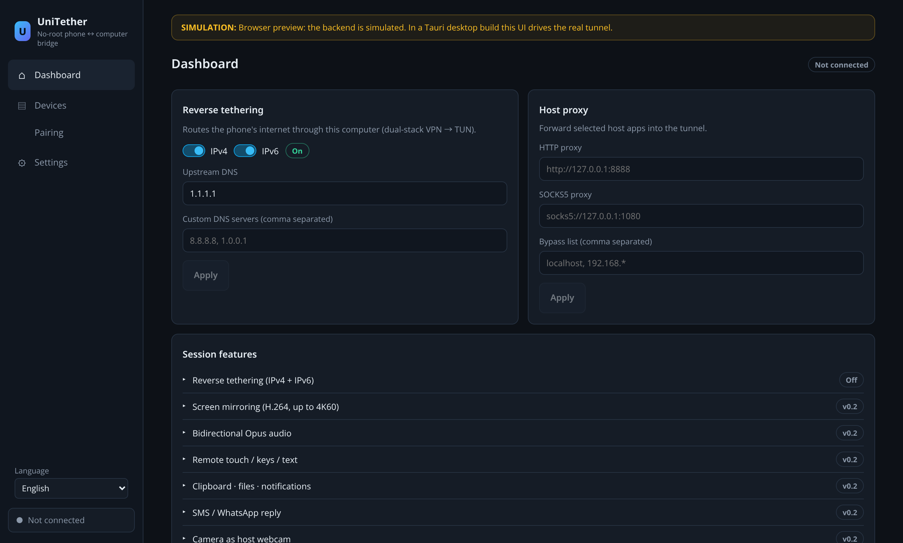
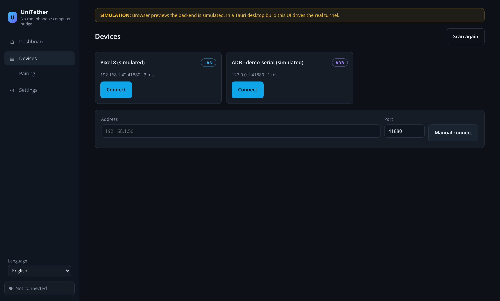
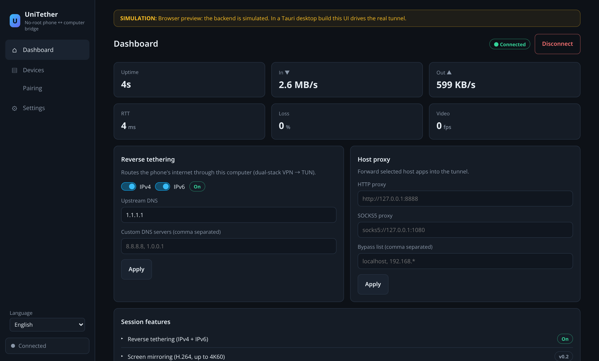
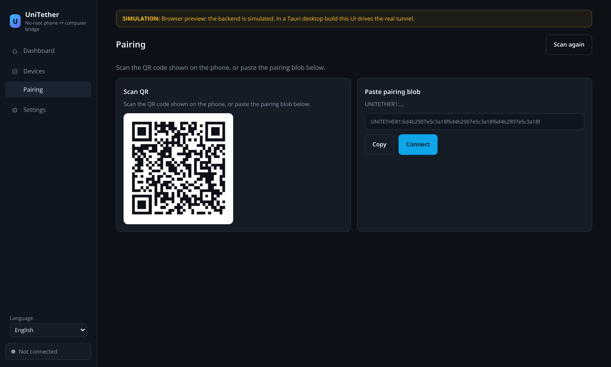
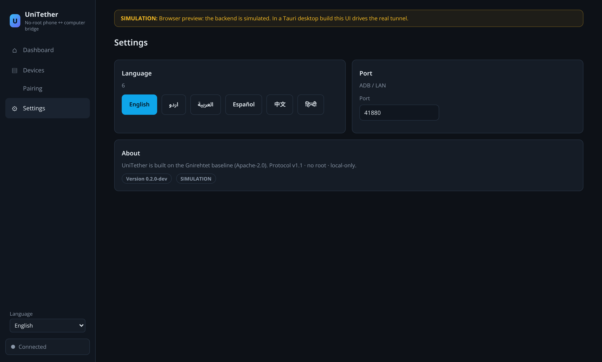
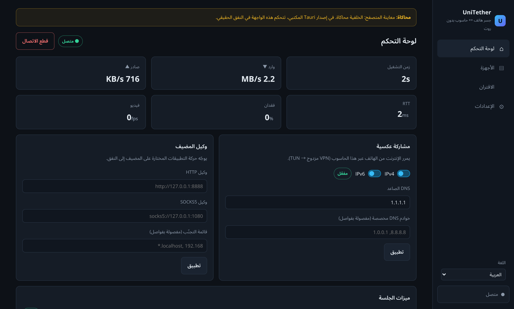

# 28 — Quickstart: full step-by-step usage guide (with screenshots)

Audience: you, on a phone (Android 5.0+) and a computer (Windows 10 /
macOS 11 / Ubuntu 20.04+), or just a browser.

All screenshots below are **real captures of the running app**
(browser preview mode — that's why the `SIMULATION` banner is visible;
the desktop build drives the real tunnel and shows no banner).

## Contents

1. [What to start (TL;DR)](#1-what-to-start-tldr)
2. [Part A — Try it now in the browser](#2-part-a--try-it-now-in-the-browser)
3. [Part B — Real reverse tethering (phone + computer)](#3-part-b--real-reverse-tethering)
4. [Screen-by-screen reference](#4-screen-by-screen-reference)
5. [Languages & RTL](#5-languages--rtl)
6. [Build & verify (developer)](#6-build--verify-developer)

---

## 1. What to start (TL;DR)

| Goal | Start this | In this order |
|---|---|---|
| See/drive the full UI now | the live browser preview (port 5173) | §2 |
| Real phone → computer internet | phone app **then** desktop app | §3: phone APK → VPN allow → desktop app → Connect → Apply |
| Build everything | `make test` (all suites) | §6 |
| Produce the APK | CI `android` job (or JDK 17 + SDK 34 + NDK 26 locally) | §6 |

---

## 2. Part A — Try it now in the browser

No installation. The preview **is** the app, running against a
clearly-labelled simulation of a phone (badge: `SIMULATION`).

### Step 1 — Open the preview

You land on the **Dashboard**, not connected. The amber banner tells you
you're in simulation mode.



### Step 2 — Go to **Devices** (left nav)

Two simulated devices appear after the scan (~0.5 s):

- `Pixel 8 (simulated)` — badge **LAN** (mDNS `_unilink._tcp` discovery)
- `ADB · demo-serial (simulated)` — badge **ADB** (USB, port 41880)



### Step 3 — Press **Connect** on a device

The button is disabled while connecting (`Connecting…`), then the sidebar
status dot turns green and the header shows **Connected** + **Disconnect**.

### Step 4 — Live stats on the **Dashboard**

Six tiles update every 2 s: **Uptime, In (▼ rate), Out (▲ rate), RTT,
Loss %, Video fps**.



### Step 5 — Configure the tunnel (the core feature)

In the **Reverse tethering** card:

1. Toggle **IPv4** and/or **IPv6** (the pill flips to `On`).
2. Set **Upstream DNS** (e.g. `1.1.1.1`) and optional
   **Custom DNS servers** (comma separated).
3. Press **Apply** → `Applied` confirmation.

In the **Host proxy** card: set **HTTP proxy** / **SOCKS5 proxy** /
**Bypass list** → **Apply**. This forwards selected host apps *into* the
tunnel.

### Step 6 — Pairing screen



- Left: **Scan QR** — a real QR renders from the `UNITETHER1:…` blob.
  On the real flow you scan the *phone's* QR with the host (or vice
  versa in v0.2).
- Right: the **pairing blob** with **Copy**, and **Connect** to pair +
  connect in one tap.
- **Scan again** regenerates the pairing data.

### Step 7 — Settings



- **Language**: English · اردو · العربية · Español · 中文 · हिन्दी
  (Arabic/Urdu flip the whole UI to RTL — §5).
- **Port**: default tunnel port (41880).
- **About**: version + `SIMULATION`/`Tauri` badge (which backend you're on).

**That's the complete flow.** In a Tauri desktop build every action is
identical — it just calls the real Rust backend instead of the simulation.

---

## 3. Part B — Real reverse tethering (phone + computer)

### On the phone (first)

| # | Action | What you see |
|---|---|---|
| 1 | Install the APK (`unitether-android` CI artifact, or `bash packaging/android-ndk.sh build` → `device/app/build/outputs/apk/release/`) | app installs — **no root, no adb** |
| 2 | Open UniTether | the app starts advertising on the LAN (mDNS) |
| 3 | Allow the **VPN** permission + **foreground notification** when Android asks | these are the *only* permissions; they're what a no-root tether needs |
| 4 | The app shows the **pairing QR** | keep the screen on |

### On the computer (second)

| # | Action |
|---|---|
| 5 | `cd host/gui && npm install && npm run tauri dev` (or run the installed desktop build) |
| 6 | **Devices** screen: your phone appears (LAN badge) → **Connect** — or if it doesn't, use **Manual connect** with the phone's IP + `41880` (or the ADB badge device if on USB) |
| 7 | If it's the first pairing, the **Pairing** screen appears → **scan the phone's QR** (or paste its blob) → **Connect** |
| 8 | **Dashboard** → IPv4 (and IPv6 if your network has it) **on** → set DNS → **Apply** |
| 9 | Open a browser on the **phone** → the internet now flows phone → this computer (TUN). Verify with `unitether stats --watch` (CLI) or the Dashboard tiles |

**Stop it**: **Disconnect** (Dashboard header) — teardown is < 1 s and
auto-stops if the link drops.

**USB/ADB transport** (same as Gnirehtet baseline): enable USB debugging
on the phone, plug in; the phone appears with the **ADB** badge on port
41880 — no LAN needed.

---

## 4. Screen-by-screen reference

### 4.1 Dashboard


| Control | Use |
|---|---|
| **Disconnect** (header) | end the session cleanly |
| **Uptime / In / Out / RTT / Loss / Video** | live session telemetry (2 s poll) |
| **Reverse tethering card** | the core: dual-stack tunnel on/off, upstream + custom DNS, **Apply** |
| **Host proxy card** | push host apps into the tunnel: HTTP / SOCKS5 / bypass list, **Apply** |
| **Session features** | honest status strip: tether = live now; mirror/audio/input/files/SMS/camera = `v0.2` (protocol-ready, device bridges present, host UI pending — see docs/27) |

### 4.2 Devices


| Control | Use |
|---|---|
| **Scan again** | re-run mDNS + ADB discovery |
| **Connect** (per card) | one-tap connect to that device |
| **Manual connect** | `address:port` for cross-subnet or fixed IPs |
| Badges | **LAN** = mDNS over Wi-Fi/LAN · **ADB** = USB |

### 4.3 Pairing


Pairing is **identity-based** (stable device ID + public key + trust
registry) — never name-based. SCAN → VERIFY → AUTHORIZE → CONNECT:

| Step | Where |
|---|---|
| SCAN | QR on the phone / **Scan QR** panel here |
| VERIFY | the blob `UNITETHER1:<identity|pubkey|mac>` — visible, copyable |
| AUTHORIZE | trust registry stores the device (persisted; survives host restarts) |
| CONNECT | **Connect** button |

Re-pair any time to re-authorize; revoking a device deletes its trust
entry (phone side).

### 4.4 Settings


Language (6, RTL-aware) · tunnel port · About/version/backend badge.

---

## 5. Languages & RTL

All six locales are complete (69 GUI keys × 6, 21 Android strings × 6,
checked in CI for key/placeholder/RTL consistency — `make i18n`).

Switch in **Settings** or the sidebar language selector. Arabic (and
Urdu) flip the entire layout to right-to-left — sidebar moves right,
text right-aligns, toggles flip direction:



---

## 6. Build & verify (developer)

```bash
make test            # protocol vectors → state → v1.1 → limits → QoS → obs →
                     # session → file → security → fuzz → resume → chaos →
                     # node → E2E real-TCP → i18n → rust → gui build
make i18n            # Android + GUI locale consistency only
make gui-build       # GUI frontend compile gate only
make gui             # full Tauri desktop app (release)
make android         # APK (needs JDK 17 + Android SDK 34 + NDK 26)
bash tests/e2e/run_e2e.sh
```

**APK**: the CI `android` job is the authority (hard gate; uploads
`unitether-android` artifact). Local: `bash packaging/android-ndk.sh build`
with `ANDROID_HOME` set. (This sandbox can't build it — Google/Maven
egress is blocked; documented in docs/27 §4.)

**Honest status**: docs/27 (IMPLEMENTED / PARTIAL / NOT IMPLEMENTED /
BLOCKED / NEXT). What's live today: pairing, dual-stack reverse
tethering, host proxy, full GUI, 6-locale i18n. v0.2: media/productivity
host-side consumers, Wi-Fi Direct, throttling profiles, cloud/relay,
supply-chain gates, Win/mac CI, soak.
